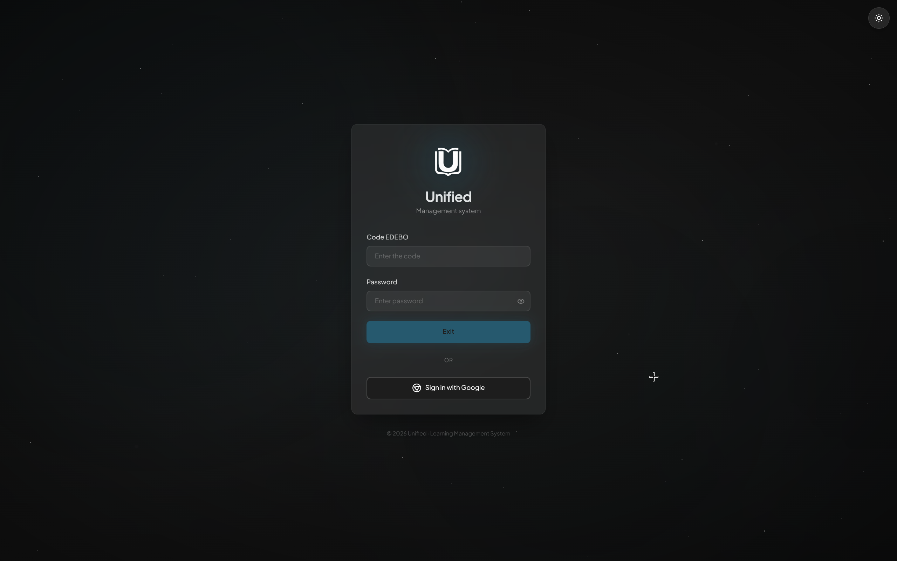
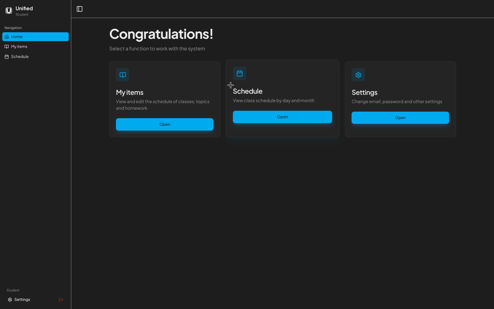
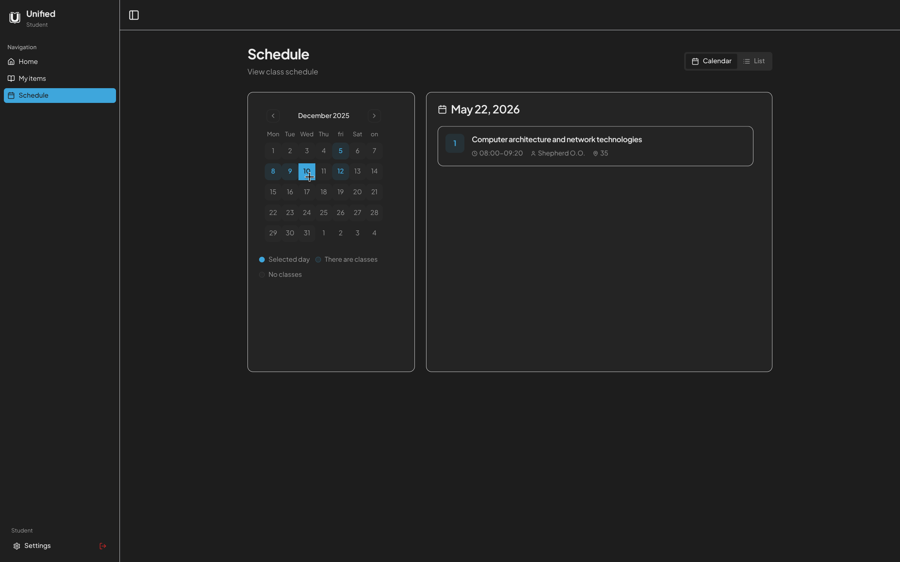
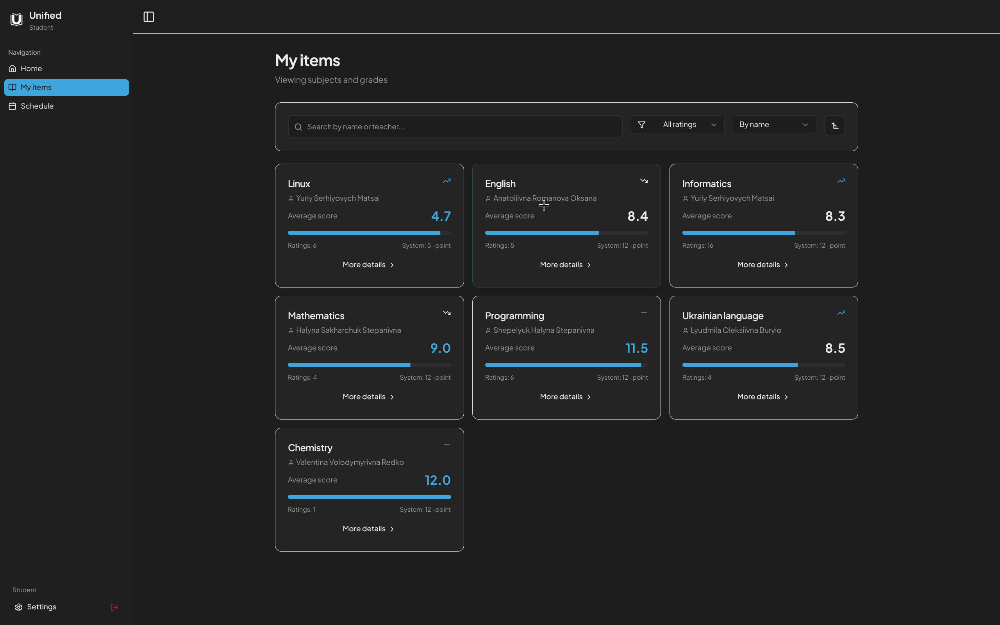
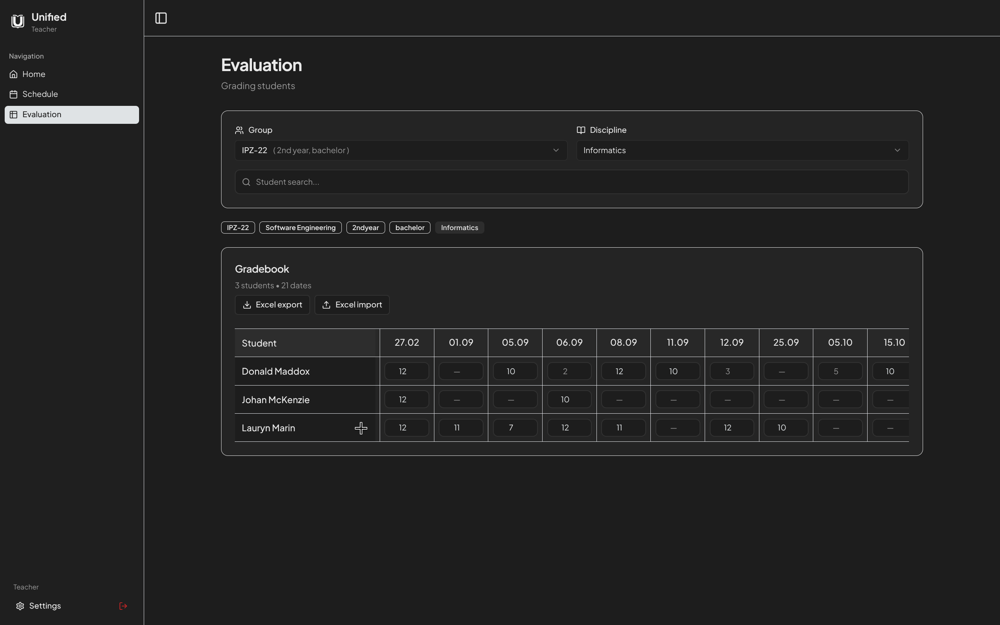
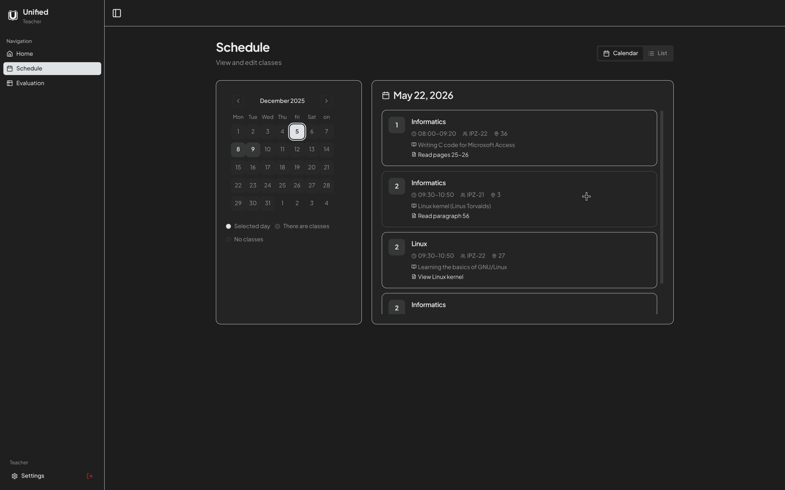
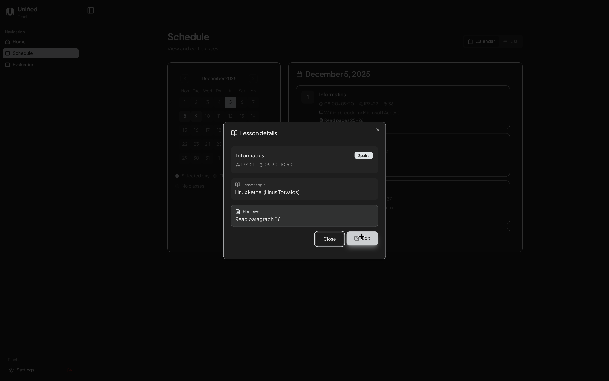

# Unified Web

Unified Web is the browser client for Unified LMS. It provides role-based workspaces for students, teachers, and administrators, with authentication and API calls proxied through a local Express server.

## Features

- Role-aware routing for student, teacher, and admin dashboards.
- Login with username/password and Google OAuth through the Unified API.
- Student views for home, schedule, and grades.
- Teacher views for grade management and schedule editing.
- Admin-oriented pages for dashboards, users, students, teachers, schedules, settings, and spreadsheet workflows.
- Theme customization, animated transitions, endpoint notifications, and reusable UI components.
- Local Express proxy for external Unified API requests.

## Preview

The screenshots in `.github/assets` show the main product surfaces.

### Authentication

The login screen supports code/password authentication and Google sign-in. It is the entry point before the app redirects users into the correct role workspace.



### Student Workspace

The student home dashboard gives learners a compact starting point for lessons, schedules, and settings.



The student schedule view shows the learner's timetable with calendar navigation and lesson details.



The student grades view presents academic results in a focused layout for checking subject performance.



### Teacher Workspace

The teacher grades view helps instructors review and manage student performance from a dedicated teaching interface.



The teacher schedule view gives instructors a calendar-oriented overview of lessons and assigned classes.



The schedule edit flow supports updating lesson details directly from the teacher workspace.



## Tech Stack

- React 18 and TypeScript for the client.
- Wouter for routing.
- TanStack Query for async data fetching.
- Express 5 for the local proxy server.
- Tailwind CSS, Radix UI primitives, and lucide-react for the interface.
- Framer Motion for transitions and entry animations.
- Vite and tsx for local development and builds.

## Prerequisites

- Node.js 18 or newer.
- npm, included with Node.js.
- Access to the Unified API if you need authenticated data.

## Getting Started

Install dependencies:

```bash
npm install
```

Start the development server:

```bash
npm run dev
```

The app runs at `http://localhost:5000` by default.

## Available Scripts

```bash
npm run dev
```

Runs the Express server with Vite middleware for local development.

```bash
npm run build
```

Builds the client and server into `dist/`.

```bash
npm run start
```

Runs the production build from `dist/index.cjs`.

```bash
npm run check
```

Runs the TypeScript checker.

## API Configuration

The local server proxies requests under `/api/proxy` to the external Unified API at:

```text
https://unifyapi.onrender.com
```

Authentication routes are handled explicitly in `server/routes.ts`, including username/password login, Google OAuth redirects, Google callback exchange, and token checks. Other `/api/proxy/*` requests are forwarded to the external API with the user's bearer token.

## Production Build

Create a production build:

```bash
npm run build
```

Start the compiled app:

```bash
npm run start
```

## License

This project is licensed under the MIT License. See [LICENSE](LICENSE) for details.
